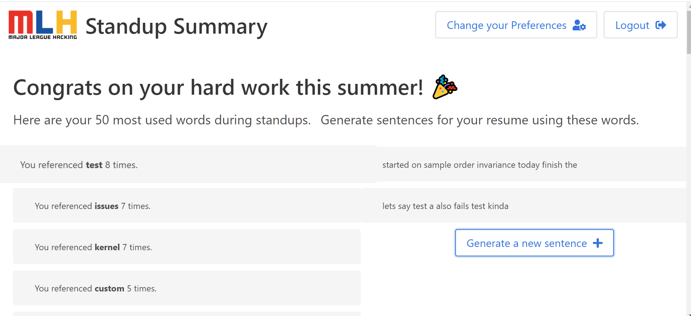

# Standup Summary

## General information
`Standup Summary` is a web app that takes in your stand-up notes on MLH Github, returns a list of most frequently used words, and generates a new sentence based on user's past comments using Markov chain rule.

Inspired by the MLH Fellowship [Half-way Hackathon](https://mlh-fellowship.gitbook.io/fellow-handbook/events/halfway-hackathon) to improve the experiences of current and future fellows, this `Standup Summary` project aims to provide a tool for fellows to recap their summer work and generate resume-ready work descriptions!

## Installation
### Dependencies
The project uses [React](https://reactjs.org/) front-end and [Flask](https://flask.palletsprojects.com/en/1.1.x/) back-end. To install the project, your machine must have `python` and `npm` installed.

Now, to install the front-end, nagivate to `/client` folder and run `npm install`; and to install the back-end, navigate to `standupSummary/server/` and run `pip install -r requirements.txt`.

### Server
Once you have installed all the dependencies, let's fire up our servers. To start the React server, run:
```
cd client/
npm start
```

To start the Flask server, on a new terminal, run:
```
export OAUTHLIB_INSECURE_TRANSPORT=1
export OAUTHLIB_RELAX_TOKEN_SCOPE=1
export FLASK_APP=app.py
cd standupSummary/server/
flask run
```
The first two commands allow us to utilize GitHub Oauth without an https request, while the subsequent commands start the Flask server.


Once you have started **both** React and Flask servers, you can use your browser to navigate to `http://localhost:3000/` and start using our app!

*Note: by default, the Flask server will run on localhost:5000 and React server will run on localhost:3000. If these ports are already in use, you will have to free these ports first before starting the servers in order for the web app to work properly.*


## User guide
Once you start the servers, you are greeted with the login screen. After you have logged in, you can choose to see your most frequently used words by choosing the *right* pod (note that only members of a port can see comments of that port). Then, you are directed to the following screen with the most frequent words that you used in your stand-up notes (excluding all English stop words).



In addition, you can generate a new sentence based on your comments using the `Generate a new sentence` button. Note that for now, 

## Development guide
### Access token
If you are interested in further developing the web app, you first should get [Github Personal Access token](https://docs.github.com/en/github/authenticating-to-github/creating-a-personal-access-token). 

For authentication access token, .... #TODO

### Future directions
1. Integrate React server into Flask server
2. Deploy the app to a live website
3. Improve the sentence generator to make it resume-ready